# Architecture

Contracts only — public members of the classes/interfaces that make up
`worktree-jumper`. Update this chart in the same commit as any change that
affects these contracts or how they relate.

```mermaid
classDiagram
    class ArgvParser {
        +parse(argv: string[]) ParsedCommand
    }

    class GitRunner {
        <<interface>>
        +run(args: string[], cwd: string) Promise~string~
    }
    class ExecFileGitRunner {
        +run(args: string[], cwd: string) Promise~string~
    }
    GitRunner <|.. ExecFileGitRunner

    class PorcelainParser {
        +parse(raw: string) Worktree[]
    }

    class WorktreeRegistry {
        +list() Promise~Worktree[]~
    }
    WorktreeRegistry --> GitRunner
    WorktreeRegistry --> PorcelainParser

    class Worktree {
        +path: string
        +head: string
        +branch: string | null
        +isBare: boolean
        +isDetached: boolean
        +isLocked: boolean
        +isCurrent: boolean
    }
    WorktreeRegistry ..> Worktree
    PorcelainParser ..> Worktree

    class ShellKind {
        <<type>>
        bash | zsh | fish
    }

    class ShellDetector {
        +detect() Promise~ShellKind~
    }
    class ParentProcessLookup {
        <<interface>>
        +parentCommand() Promise~string | null~
    }
    class PsParentProcessLookup {
        +parentCommand() Promise~string | null~
    }
    ParentProcessLookup <|.. PsParentProcessLookup
    ShellDetector --> ParentProcessLookup

    class ShellQuoter {
        +quote(shell: ShellKind, value: string) string
    }

    class FunctionEmitter {
        +emit(shell: ShellKind, functionName: string) string
    }
    FunctionEmitter --> ShellKind

    class RcResolver {
        +resolve(shell: ShellKind) RcTarget
    }

    class FileSystem {
        <<interface>>
        +exists(path: string) Promise~boolean~
        +readFile(path: string) Promise~string~
        +writeFile(path: string, content: string) Promise~void~
        +mkdir(path: string) Promise~void~
    }
    class NodeFileSystem {
        +exists(path: string) Promise~boolean~
        +readFile(path: string) Promise~string~
        +writeFile(path: string, content: string) Promise~void~
        +mkdir(path: string) Promise~void~
    }
    FileSystem <|.. NodeFileSystem

    class RcInstaller {
        +install(target: RcTarget, snippet: string) Promise~void~
    }
    RcInstaller --> FileSystem

    class Writer {
        <<interface>>
        +write(text: string) void
    }
    class MachineOutput {
        +write(text: string) void
    }
    Writer <|.. MachineOutput

    class PathDisplay {
        +format(path: string) string
    }

    class Colorizer {
        <<interface>>
        +branch(text: string) string
        +path(text: string) string
        +commit(text: string) string
        +marker(text: string) string
        +current(text: string) string
    }
    class StyleTextColorizer {
        +branch(text: string) string
        +path(text: string) string
        +commit(text: string) string
        +marker(text: string) string
        +current(text: string) string
    }
    Colorizer <|.. StyleTextColorizer

    class WorktreePresenter {
        +present(worktree: Worktree) PresentedWorktree
    }
    WorktreePresenter --> PathDisplay
    WorktreePresenter --> Colorizer
    WorktreePresenter ..> Worktree

    class WorktreePicker {
        <<interface>>
        +pick(worktrees: Worktree[]) Promise~Worktree | Symbol~
    }
    class Picker {
        +pick(worktrees: Worktree[]) Promise~Worktree | Symbol~
    }
    WorktreePicker <|.. Picker
    Picker --> WorktreePresenter

    class Confirmer {
        <<interface>>
        +confirm(message: string) Promise~boolean | Symbol~
    }
    class InstallConfirmer {
        +confirm(message: string) Promise~boolean | Symbol~
    }
    Confirmer <|.. InstallConfirmer

    class JumpCommand {
        +run() Promise~JumpResult~
    }
    JumpCommand --> WorktreeRegistry
    JumpCommand --> WorktreePicker
    JumpCommand --> Writer

    class InitCommand {
        +run(input: InitCommandInput) Promise~InitResult~
    }
    InitCommand --> ShellDetector
    InitCommand --> FunctionEmitter
    InitCommand --> ShellQuoter
    InitCommand --> RcResolver
    InitCommand --> RcInstaller
    InitCommand --> Confirmer
    InitCommand --> Writer
    InitCommand --> PathDisplay
```

## Notes

- `ArgvParser`, `FunctionEmitter`, `ShellQuoter`, `RcResolver`,
  `PorcelainParser`, and `PathDisplay` are pure domain objects with no I/O
  of their own. `ArgvParser` wraps `node:util`'s `parseArgs`, adding
  subcommand detection and typed `UsageError`s. `PorcelainParser.parse`
  actually returns `Worktree` records minus `isCurrent` — `WorktreeRegistry`
  resolves that flag afterward by comparing realpaths, then merges it in.
- `GitRunner` and `FileSystem` are the only two process/disk boundaries in
  the codebase; every other component depends on them (directly or via
  `WorktreeRegistry`/`RcInstaller`) rather than touching `node:child_process`
  or `node:fs` itself. `WorktreeRegistry` also takes an injected `RealpathFn`
  (a single-function boundary, defaulting to `node:fs/promises`'
  `realpath`) to normalize paths when marking the current worktree.
- `WorktreePresenter` formats a `Worktree` into a `PresentedWorktree`
  (label + `~`-abbreviated hint) for the picker; it and `InitCommand` both
  depend on `PathDisplay` as the single path-abbreviation domain object,
  rather than duplicating that logic. It now also colors each field kind —
  branch, path, commit sha, and status markers — through an injected
  `Colorizer`, so the listing is scannable at a glance. `StyleTextColorizer`
  is the sole module that emits ANSI, via Node's native `util.styleText`
  (no color dependency), and only when the `colorSupported` helper judges
  the picker's stderr stream capable of it.
- `Picker` and `InstallConfirmer` are the only two modules in the codebase
  that import `@clack/prompts`; `JumpCommand` and `InitCommand` depend on
  the `WorktreePicker`/`Confirmer` interfaces instead, so they're testable
  without it.
- Every exported error, interface, and options/data shape (e.g. `RcTarget`,
  `PresentedWorktree`, `PickerOptions`) lives in its own file per
  CLAUDE.md's file-naming rule, but plain data shapes with no behavior are
  omitted from this diagram — only classes, interfaces, and their
  collaborations are shown.
- `src/index.ts` is the composition root: it constructs the real
  implementations of every boundary, dispatches on the parsed command, and
  maps thrown errors to stderr messages and exit codes. It has no public
  contract of its own and isn't shown above.
