# Architecture

Contracts only — public members of the classes/interfaces that make up
`worktree-jumper`. Update this chart in the same commit as any change that
affects these contracts or how they relate.

```mermaid
classDiagram
    class ArgvParser {
        +parse(argv: string[]) ParsedCommand
    }

    class GitRunner {
        <<interface>>
        +run(args: string[], cwd: string) Promise~string~
    }
    class ExecFileGitRunner {
        +run(args: string[], cwd: string) Promise~string~
    }
    GitRunner <|.. ExecFileGitRunner

    class WorktreeRegistry {
        +list() Promise~Worktree[]~
    }
    WorktreeRegistry --> GitRunner

    class Worktree {
        +path: string
        +head: string
        +branch: string | null
        +isBare: boolean
        +isDetached: boolean
        +isLocked: boolean
        +isCurrent: boolean
    }
    WorktreeRegistry ..> Worktree

    class ShellKind {
        <<type>>
        bash | zsh | fish
    }

    class ShellDetector {
        +detect() Promise~ShellKind~
    }
    class ParentProcessLookup {
        <<interface>>
        +parentCommand() Promise~string | null~
    }
    class PsParentProcessLookup {
        +parentCommand() Promise~string | null~
    }
    ParentProcessLookup <|.. PsParentProcessLookup
    ShellDetector --> ParentProcessLookup

    class ShellQuoter {
        +quote(shell: ShellKind, value: string) string
    }

    class FunctionEmitter {
        +emit(shell: ShellKind, functionName: string) string
    }
    FunctionEmitter --> ShellKind

    class RcResolver {
        +resolve(shell: ShellKind) RcTarget
    }

    class FileSystem {
        <<interface>>
        +exists(path: string) Promise~boolean~
        +readFile(path: string) Promise~string~
        +writeFile(path: string, content: string) Promise~void~
        +mkdir(path: string) Promise~void~
    }
    class NodeFileSystem {
        +exists(path: string) Promise~boolean~
        +readFile(path: string) Promise~string~
        +writeFile(path: string, content: string) Promise~void~
        +mkdir(path: string) Promise~void~
    }
    FileSystem <|.. NodeFileSystem

    class RcInstaller {
        +install(target: RcTarget, snippet: string) Promise~void~
    }
    RcInstaller --> FileSystem

    class Writer {
        <<interface>>
        +write(text: string) void
    }
    class MachineOutput {
        +write(text: string) void
    }
    Writer <|.. MachineOutput

    class WorktreePicker {
        <<interface>>
        +pick(worktrees: Worktree[]) Promise~Worktree | Symbol~
    }
    class Picker {
        +pick(worktrees: Worktree[]) Promise~Worktree | Symbol~
    }
    WorktreePicker <|.. Picker

    class Confirmer {
        <<interface>>
        +confirm(message: string) Promise~boolean | Symbol~
    }
    class InstallConfirmer {
        +confirm(message: string) Promise~boolean | Symbol~
    }
    Confirmer <|.. InstallConfirmer

    class JumpCommand {
        +run() Promise~JumpResult~
    }
    JumpCommand --> WorktreeRegistry
    JumpCommand --> WorktreePicker
    JumpCommand --> Writer

    class InitCommand {
        +run(input: InitCommandInput) Promise~InitResult~
    }
    InitCommand --> ShellDetector
    InitCommand --> FunctionEmitter
    InitCommand --> ShellQuoter
    InitCommand --> RcResolver
    InitCommand --> RcInstaller
    InitCommand --> Confirmer
    InitCommand --> Writer
```

## Notes

- `ArgvParser`, `FunctionEmitter`, `ShellQuoter`, and `RcResolver` are pure
  domain objects with no I/O of their own.
- `GitRunner` and `FileSystem` are the only two process/disk boundaries in
  the codebase; every other component depends on them (directly or via
  `WorktreeRegistry`/`RcInstaller`) rather than touching `node:child_process`
  or `node:fs` itself.
- `Picker` is the only module that imports `@clack/prompts`; `JumpCommand`
  and `InitCommand` depend on its `WorktreePicker`/`Confirmer` interfaces,
  not the concrete class, so they're testable without it.
- `src/index.ts` is the composition root: it constructs the real
  implementations of every boundary, dispatches on the parsed command, and
  maps thrown errors to stderr messages and exit codes. It has no public
  contract of its own and isn't shown above.
